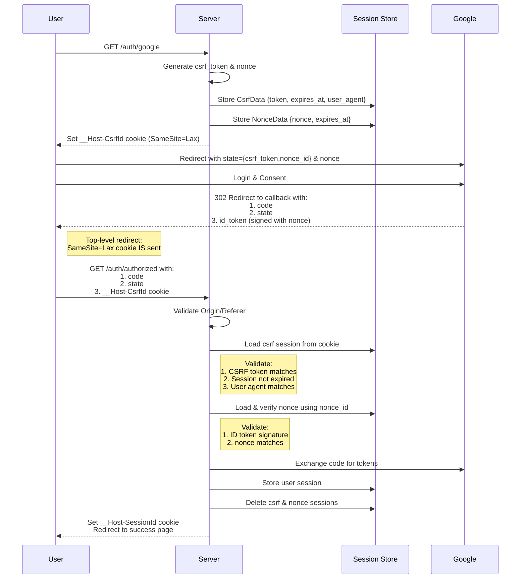
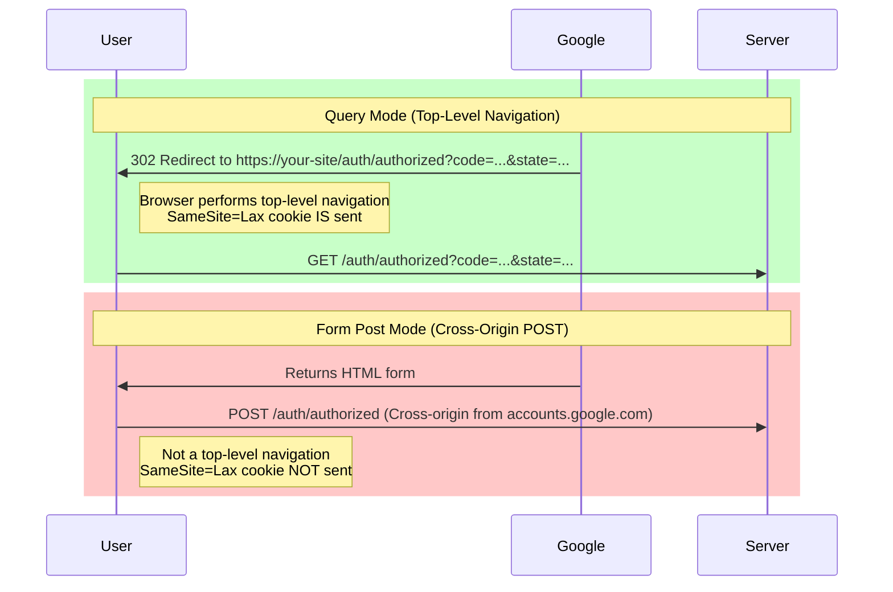
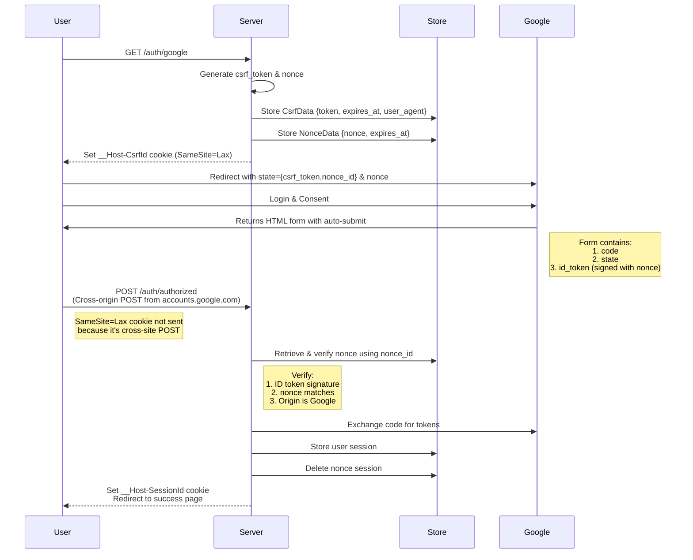
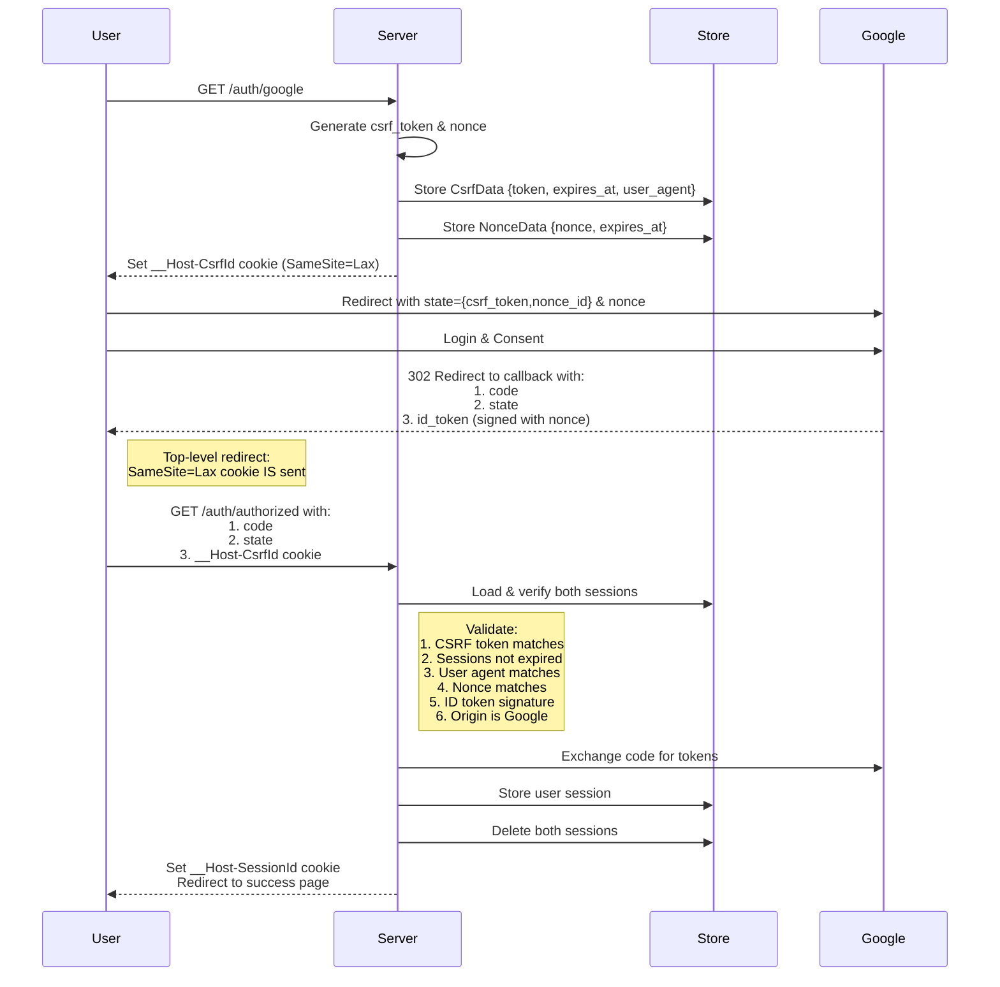
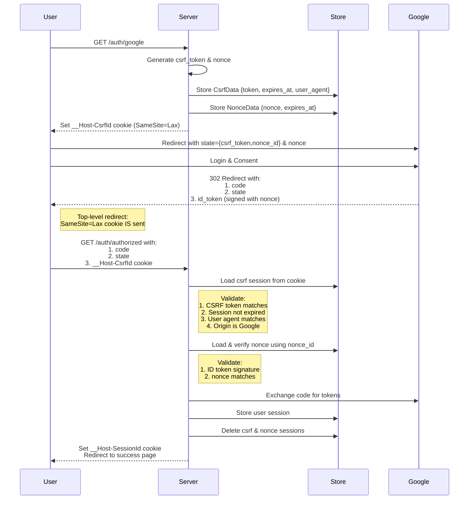
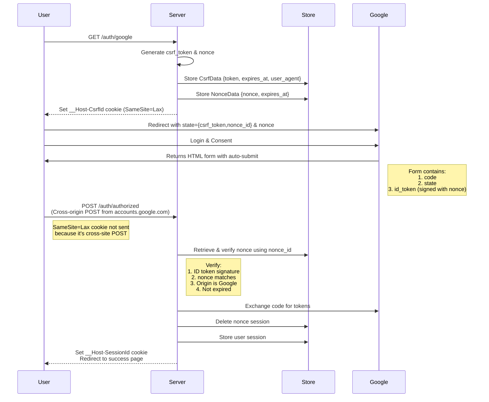
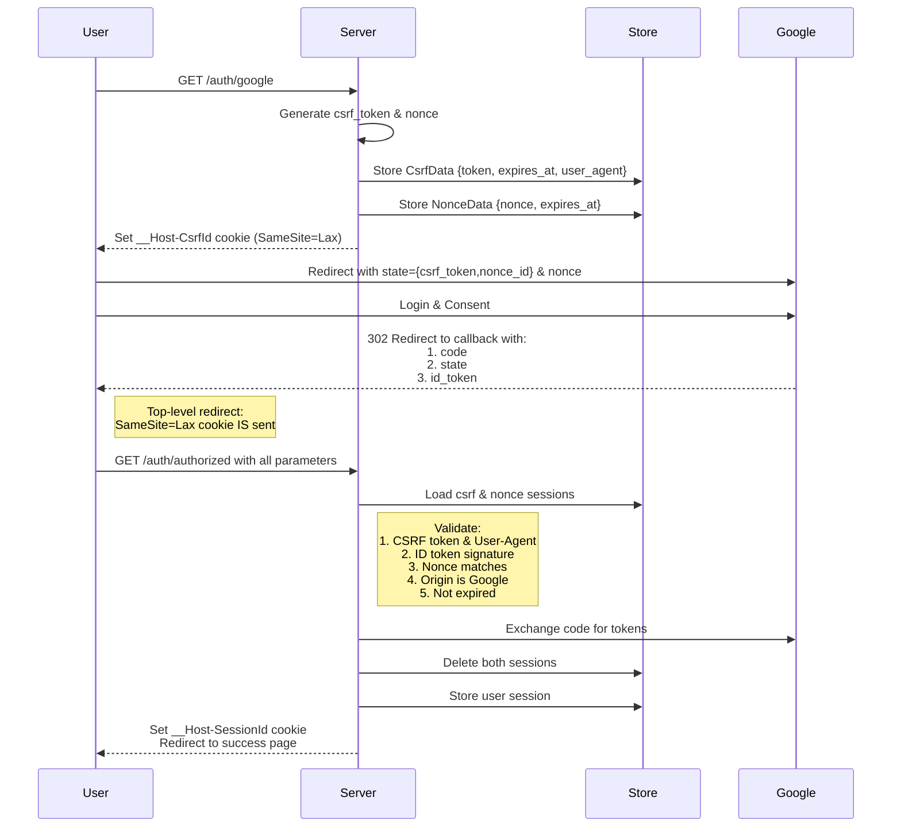

# axum google oauth2 example

- [axum google oauth2 example](#axum-google-oauth2-example)
  - [Howto](#howto)
  - [security enhancement by csrf\_token](#security-enhancement-by-csrf_token)
    - [response\_mode=query](#response_modequery)
  - [Claude.ai analysis](#claudeai-analysis)
    - [1. Form Post Mode Analysis](#1-form-post-mode-analysis)
      - [Flow Diagram](#flow-diagram)
      - [Implementation Detail](#implementation-detail)
      - [Security Analysis](#security-analysis)
    - [2. Query Mode Analysis](#2-query-mode-analysis)
      - [Flow Diagram](#flow-diagram-1)
      - [Implementation Detail](#implementation-detail-1)
      - [Security Analysis](#security-analysis-1)
    - [Recommendation: USE FORM POST MODE](#recommendation-use-form-post-mode)
  - [Why is the \_\_Host-CsrfId sent in query mode but not in form\_post?](#why-is-the-__host-csrfid-sent-in-query-mode-but-not-in-form_post)
  - [Claude another version of analysis](#claude-another-version-of-analysis)
  - [Claude](#claude)
- [1. Form Post Mode Analysis](#1-form-post-mode-analysis-1)
  - [Implementation Details](#implementation-details)
  - [Security Analysis](#security-analysis-2)
- [2. Query Mode Analysis](#2-query-mode-analysis-1)
  - [Implementation Details](#implementation-details-1)
  - [Security Analysis](#security-analysis-3)
- [Recommendation: USE FORM POST MODE](#recommendation-use-form-post-mode-1)
  - [Claude](#claude-1)
    - [Form Post Mode Details](#form-post-mode-details)
    - [Query Mode Details](#query-mode-details)
    - [Final Recommendation: USE FORM POST MODE](#final-recommendation-use-form-post-mode)

## Howto

もともとdiscord用の[axum/examples/oauth](https://github.com/tokio-rs/axum/blob/main/examples/oauth/src/main.rs)を改造

```text
ngrok http 3000
```

.envで、ngrokのURLをORIGINに設定

.env

```text
CLIENT_ID=$client_id
CLIENT_SECRET=$client_secret
ORIGIN="https://xxxxx.ngrok-free.app"
#ORIGIN='https://localhost:3443'
```

```text
cargo watch -x run
```

## security enhancement by csrf_token

### response_mode=query


- storeにCsrfIdをキーとして保存されているcsrf_tokenと、stateにセットされているcsrf_tokenが一致しないと、⑥以降の処理に進まない。
- 攻撃者が、③までを実行すると、正しいcsrf_token、CsrfId、Auth codeを入手することができてしまう
- 攻撃者は、被害者を攻撃者のアカウントにログインさせることで、不正に情報を取得するなどが可能になる
  - [攻撃の例](csrf-attack-example.md)

- `_Host-` プリフィックスにより、Cookieがそのホストにによりセットされたことが保証される。
- `User-Agent`チェックを行うことで、攻撃を若干難しくすることができるかも？？？
- Origin/Refererチェックにより、`https://accounts.google.com`からの遷移であることが保証される。

## Claude.ai analysis

### 1. Form Post Mode Analysis

#### Flow Diagram


#### Implementation Detail

1. Initial Request:

```rust
// Server generates and stores both tokens
let csrf_token = generate_random_token();
let nonce = generate_random_token();

// Store in separate sessions
store.store_session(CsrfData{...});
store.store_session(NonceData{...});

// Create state parameter
let state_params = StateParams {
    csrf_token,
    nonce_id
};
```

2. Google's Auto-submit Form:

```html
<form method="post" action="https://your-site/auth/authorized">
    <input type="hidden" name="code" value="4/P7q7W91...">
    <input type="hidden" name="state" value="{csrf_token,nonce_id}">
    <input type="hidden" name="id_token" value="eyJ0...">
    <script>window.onload = function() { document.forms[0].submit() }</script>
</form>
```

3. Server-side Verification:

```rust
// Verify nonce from ID token matches stored nonce
async fn verify_nonce(
    auth_response: &AuthResponse,
    idinfo: IdInfo,
    store: &MemoryStore,
) -> Result<(), AppError> {
    let session = store.load_session(state_in_response.nonce_id).await?;
    let nonce_data: NonceData = session.get("nonce_data")?;
    
    if idinfo.nonce != Some(nonce_data.nonce) {
        return Err(anyhow::anyhow!("Nonce mismatch").into());
    }
    
    // Delete session after use
    store.destroy_session(session).await?;
    Ok(())
}
```

#### Security Analysis

Strengths:
1. Authorization code protected:
   - Never exposed in URLs
   - Not in browser history
   - Not in server logs
   - Not in Referer headers
2. Strong cryptographic protection:
   - Server-side nonce storage
   - Google-signed ID token
   - One-time use sessions
3. Origin validation ensures request from Google
4. All sensitive data in POST body

Concerns:
1. No CSRF cookie validation (mitigated by other measures)
2. State parameter could be modified (limited impact due to server-side storage)

### 2. Query Mode Analysis

#### Flow Diagram



#### Implementation Detail

1. Initial Flow same as form_post mode

2. Additional CSRF Validation:

```rust
async fn csrf_checks(
    cookies: headers::Cookie,
    store: &MemoryStore,
    query: &AuthResponse,
    headers: HeaderMap,
) -> Result<(), AppError> {
    let csrf_id = cookies.get(CSRF_COOKIE_NAME)?;
    let session = store.load_session(csrf_id.to_string()).await?;
    let csrf_data: CsrfData = session.get("csrf_data")?;

    if state_in_response.csrf_token != csrf_data.csrf_token {
        return Err(anyhow::anyhow!("CSRF token mismatch").into());
    }
    // Additional checks...
}
```

#### Security Analysis

Strengths:

1. Full CSRF protection via cookie
2. Double verification:
   - CSRF token validation
   - Nonce validation
3. All protections from form_post mode
4. One-time use sessions

Critical Issues:

1. Authorization code exposed in:
   - URL parameters
   - Browser history
   - Server logs
   - Referer headers

### Recommendation: USE FORM POST MODE

The decision comes down to a key security principle: protecting the authorization code is more critical than additional CSRF protection.

Form Post mode is superior because:

1. Primary OAuth security concern is protecting sensitive tokens
2. POST body transmission protects critical data
3. The lack of CSRF cookie protection is well compensated by:
   - Server-side nonce validation
   - ID token signatures
   - Origin verification
   - Session management

The risk of exposing authorization codes in URLs (query mode) significantly outweighs the benefit of additional CSRF protection.


## Why is the __Host-CsrfId sent in query mode but not in form_post?

The difference between response_mode=query and form_post:



The key difference is:

1. Query mode (code & state in URL):

- Uses HTTP 302 redirect
- Triggers browser's top-level navigation
- `SameSite=Lax` cookies ARE sent with top-level navigation GET requests
- The CSRF protection works as intended

2. Form POST mode:

- Uses HTML form submission from Google's domain
- Is a cross-origin POST request
- NOT a top-level navigation
- `SameSite=Lax` cookies are NOT sent

This is why CSRF verification works in query mode but fails in form_post mode. The browser treats these navigation patterns differently with respect to SameSite cookie policy.


## Claude another version of analysis



Form Post Mode Detail:
1. Initial Flow:
- Client requests `/auth/google`
- Server generates two sessions:
  - CSRF session with token (unused in form_post)
  - Nonce session with server-generated nonce
- Both include expiration time
- State parameter includes csrf_token and nonce_id

2. Google Auth Response:
```html
<form method="post" action="https://your-site/auth/authorized">
    <input type="hidden" name="code" value="4/P7q7W91...">
    <input type="hidden" name="state" value="{csrf_token,nonce_id}">
    <input type="hidden" name="id_token" value="eyJ0...">
</form>
```

3. Security Mechanisms:
- Server-side nonce storage (only ID in state)
- Google-signed ID token containing nonce
- Origin validation ensures request from Google
- All sensitive data in POST body
- One-time use sessions
- `__Host-` prefix cookies



Query Mode Detail:
1. Initial Flow:
- Same as form_post mode
- Both CSRF and nonce sessions created
- Cookie will be sent with callback due to GET request

2. Double Validation:
- CSRF validation:
  - Compare cookie session token with state token
  - Verify user agent and expiration
- Nonce validation:
  - Verify ID token signature
  - Match nonce from token with stored nonce
  - Check session expiration

3. Security Considerations:
- Full CSRF protection via cookie
- All form_post security features
- BUT exposes code in URL

Final Recommendation: USE FORM POST MODE

1. Key Security Advantages:
- Protects authorization code and tokens:
  - No URL exposure
  - No browser history risk
  - No log file risk
  - No Referer header leakage
- Strong security through:
  - Server-side nonce validation
  - Cryptographic signatures
  - Origin verification
  - Session management

2. Security Trade-off Analysis:
- Form Post loses CSRF cookie but gains:
  - Better code protection
  - Cleaner URLs
  - Reduced logging risks
- Query mode adds CSRF protection but:
  - Exposes sensitive parameters in URLs
  - Higher risk of token leakage
  
The protection of authorization codes and tokens takes precedence over CSRF protection in this context, making form_post mode the more secure choice.

## Claude

# 1. Form Post Mode Analysis


## Implementation Details
1. Initial Request (/auth/google):
   - Server generates csrf_token and nonce
   - Stores them in separate sessions with IDs
   - Sets `__Host-CsrfId` cookie (though unused in POST mode)
   - Redirects to Google with state={csrf_token,nonce_id} & nonce

2. Google Authentication:
   - User authenticates with Google
   - Google returns auto-submit form:
   ```html
   <form method="post" action="https://your-site/auth/authorized">
       <input type="hidden" name="code" value="4/P7q7W91...">
       <input type="hidden" name="state" value="{csrf_token,nonce_id}">
       <input type="hidden" name="id_token" value="eyJ0...">
       <script>window.onload = function() { document.forms[0].submit() }</script>
   </form>
   ```

3. Callback Processing:
   - Server receives POST from Google's domain
   - Verifies:
     - Origin is Google
     - ID token signature
     - Nonce in ID token matches stored nonce
   - Exchanges code for tokens
   - Creates authenticated session
   - Deletes nonce session (one-time use)

## Security Analysis
Strengths:
- Authorization code and tokens in POST body
- Server-side nonce storage (only ID in state)
- Cryptographic verification via Google-signed ID token
- One-time use sessions
- Origin validation
- `__Host-` prefix enforcement

Concerns:
- No CSRF cookie validation (due to SameSite=Lax)
- State parameter could be modified (mitigated by server-side storage)

# 2. Query Mode Analysis



## Implementation Details
1. Initial Request (/auth/google):
   - Same as form post mode
   - Both cookies will be used for validation

2. Google Authentication:
   - After user consent, Google performs 302 redirect
   - All parameters in URL query string
   - Browser follows redirect with cookie (due to GET)

3. Callback Processing:
   - Server receives GET with cookie
   - Full validation:
     - CSRF token matches
     - Nonce validates
     - User agent matches
     - Origin verification
     - Sessions not expired
   - Creates authenticated session
   - Deletes both sessions

## Security Analysis
Strengths:
- Full CSRF protection via cookie
- All form post protections included
- Double verification (CSRF + nonce)
- User agent validation

Concerns:
- Authorization code exposed in URL
- Potential logging/history exposure
- Referer header leakage risk

# Recommendation: USE FORM POST MODE

Rationale:
1. Primary OAuth2 Security Goal: Protect the authorization code
   - Form post keeps code in request body
   - Prevents URL/log/Referer exposure
   
2. Compensating Controls in Form Post:
   - Server-side nonce validation
   - Cryptographic verification (ID token)
   - Origin validation
   - Single-use sessions
   
3. Risk Assessment:
   - Code exposure (query mode) > CSRF risk (form post)
   - Form post's protections sufficient without CSRF cookie

Therefore: `response_mode=form_post` provides better overall security for this implementation.

## Claude

Let me create a clear, organized analysis:



### Form Post Mode Details

1. Google's Auto-Submit Form:
```html
<form method="post" action="https://your-site/auth/authorized">
    <input type="hidden" name="code" value="4/P7q7W91...">
    <input type="hidden" name="state" value="{csrf_token,nonce_id}">
    <input type="hidden" name="id_token" value="eyJ0...">
</form>
```

2. Security Features:
- Server-side nonce storage (only ID in state)
- Nonce validated through Google-signed ID token
- Origin validation ensures request from Google
- One-time use sessions (immediate deletion)
- POST parameters not exposed in URLs
- `__Host-` prefix enforces secure cookies

3. Form Post Strengths & Concerns:
```
Strengths:
✓ Code and tokens in POST body only
✓ No URL parameter exposure
✓ No Referer header leakage
✓ Strong server-side validation
✓ One-time use enforced

Concerns:
⚠️ CSRF cookie not sent (but mitigated by other measures)
⚠️ State parameter modifiable (limited impact due to server-side nonce)
```



### Query Mode Details

1. Security Features:
- Full CSRF protection via cookie
- Double validation (CSRF + nonce)
- All form_post protections included
- User-Agent validation
- One-time use sessions

2. Query Mode Strengths & Concerns:
```
Strengths:
✓ Complete CSRF protection
✓ Double security verification
✓ Full server-side validation
✓ User-Agent validation

Concerns:
❌ Authorization code exposed in URL
❌ Parameters visible in browser history
❌ Potential server log exposure
❌ Referer header risks
```

### Final Recommendation: USE FORM POST MODE

The decision comes down to:
1. Form Post Benefits:
- Protects critical authorization code
- Prevents URL/log exposures
- Avoids Referer header leaks
- Maintains strong security through:
  - Server-side nonce validation
  - Google's cryptographic signatures
  - Origin verification
  - Session management

2. Security Trade-off:
- Lost: CSRF cookie protection
- Gained: Critical token protection
- Net result: Better security posture

The lack of CSRF protection in form_post mode is well mitigated by other security measures, while the URL exposure risks in query mode cannot be mitigated. Therefore, form_post mode offers better overall security for OAuth 2.0 flows.