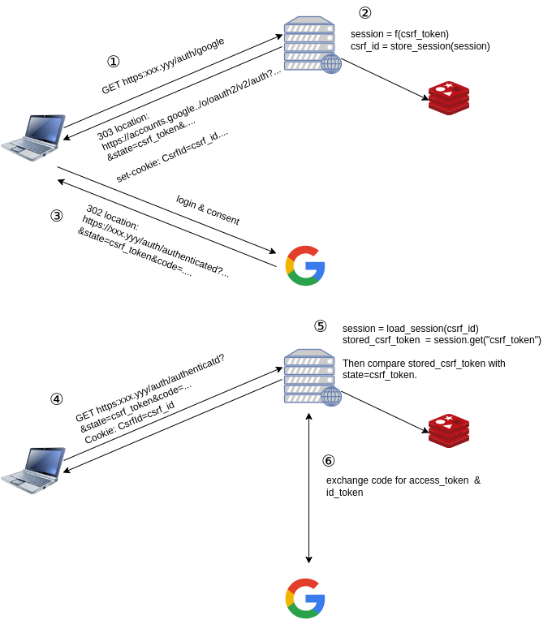
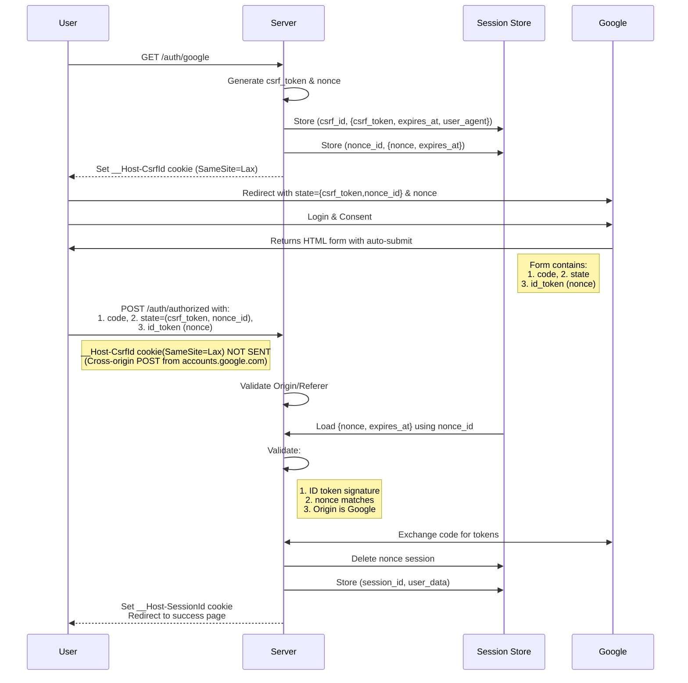
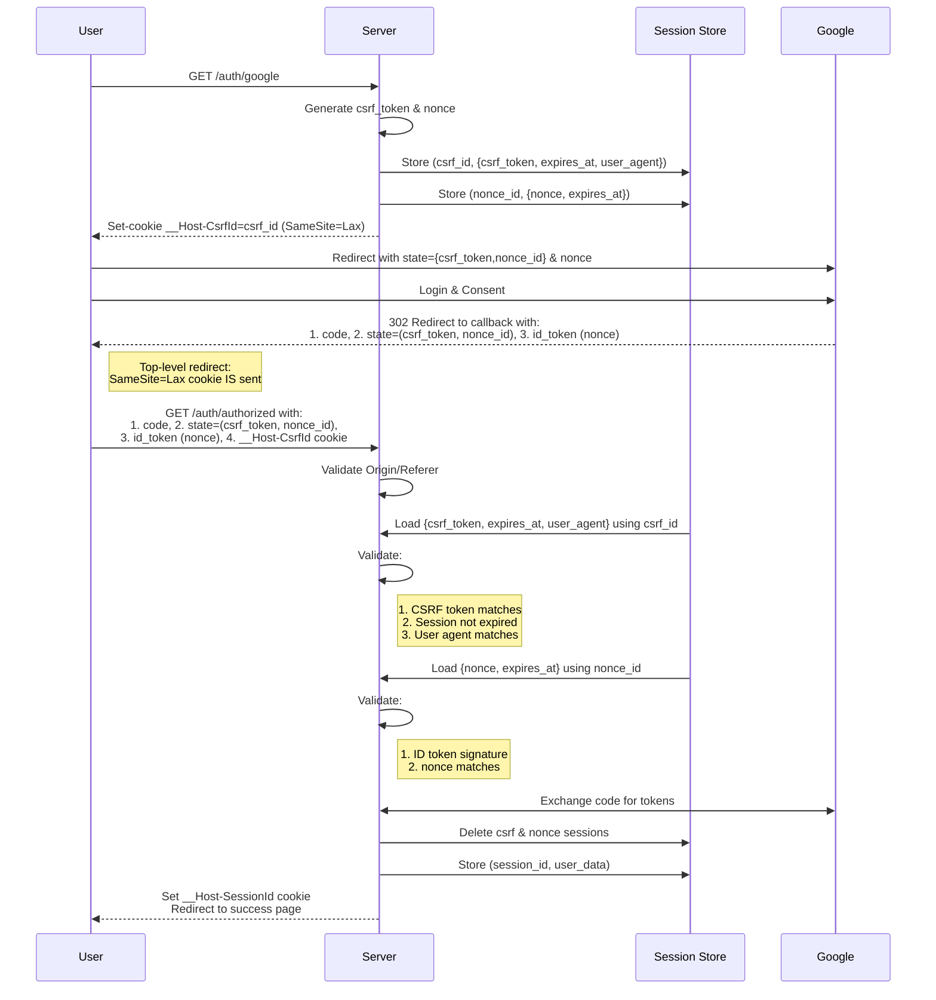
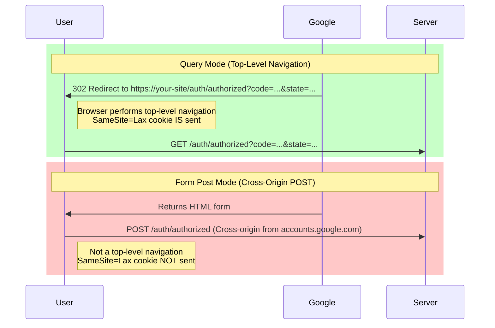

# axum google oauth2 example

- [axum google oauth2 example](#axum-google-oauth2-example)
  - [Howto](#howto)
  - [security enhancement by csrf\_token](#security-enhancement-by-csrf_token)
    - [response\_mode=query](#response_modequery)
  - [Claude.ai analysis](#claudeai-analysis)
    - [1. Form Post Mode Analysis](#1-form-post-mode-analysis)
      - [Flow Diagram](#flow-diagram)
      - [Implementation Detail](#implementation-detail)
      - [Security Analysis](#security-analysis)
    - [2. Query Mode Analysis](#2-query-mode-analysis)
      - [Flow Diagram](#flow-diagram-1)
      - [Implementation Detail](#implementation-detail-1)
      - [Security Analysis](#security-analysis-1)
    - [form\_post or query?: USE FORM POST MODE](#form_post-or-query-use-form-post-mode)
  - [Why is the "\_\_Host-CsrfId" sent in query mode but not in form\_post?](#why-is-the-__host-csrfid-sent-in-query-mode-but-not-in-form_post)

## Howto

もともとdiscord用の[axum/examples/oauth](https://github.com/tokio-rs/axum/blob/main/examples/oauth/src/main.rs)を改造

```text
ngrok http 3000
```

.envで、ngrokのURLをORIGINに設定

.env

```text
CLIENT_ID=$client_id
CLIENT_SECRET=$client_secret
ORIGIN="https://xxxxx.ngrok-free.app"
#ORIGIN='https://localhost:3443'
```

```text
cargo watch -x run
```

## security enhancement by csrf_token

### response_mode=query



- storeにCsrfIdをキーとして保存されているcsrf_tokenと、stateにセットされているcsrf_tokenが一致しないと、⑥以降の処理に進まない。
- 攻撃者が、③までを実行すると、正しいcsrf_token、CsrfId、Auth codeを入手することができてしまう
- 攻撃者は、被害者を攻撃者のアカウントにログインさせることで、不正に情報を取得するなどが可能になる
  - [攻撃の例](csrf-attack-example.md)

- `_Host-` プリフィックスにより、Cookieがそのホストにによりセットされたことが保証される。
- `User-Agent`チェックを行うことで、攻撃を若干難しくすることができるかも？？？
- Origin/Refererチェックにより、`https://accounts.google.com`からの遷移であることが保証される。

## Claude.ai analysis

### 1. Form Post Mode Analysis

#### Flow Diagram



#### Implementation Detail

1. Initial Request (/auth/google):

   - Server generates csrf_token and nonce
   - Stores them in separate sessions with IDs
   - Sets `__Host-CsrfId` cookie (though unused in POST mode)
   - Redirects to Google with state={csrf_token,nonce_id} & nonce

```rust
// Server generates and stores both tokens
let csrf_token = generate_random_token();
let nonce = generate_random_token();

// Store in separate sessions
store.store_session(CsrfData{...});
store.store_session(NonceData{...});

// Create state parameter
let state_params = StateParams {
    csrf_token,
    nonce_id
};
```

2. Google Authentication:

   - User authenticates with Google
   - Google returns auto-submit form:

```html
<form method="post" action="https://your-site/auth/authorized">
    <input type="hidden" name="code" value="4/P7q7W91...">
    <input type="hidden" name="state" value="{csrf_token,nonce_id}">
    <input type="hidden" name="id_token" value="eyJ0...">
    <script>window.onload = function() { document.forms[0].submit() }</script>
</form>
```

3. Server-side Verification:

   - Server receives POST from Google's domain
   - Verifies:
     - Origin is Google
     - ID token signature
     - Nonce in ID token matches stored nonce
   - Exchanges code for tokens
   - Creates authenticated session
   - Deletes nonce session (one-time use)


```rust
// Verify nonce from ID token matches stored nonce
async fn verify_nonce(
    auth_response: &AuthResponse,
    idinfo: IdInfo,
    store: &MemoryStore,
) -> Result<(), AppError> {
    let session = store.load_session(state_in_response.nonce_id).await?;
    let nonce_data: NonceData = session.get("nonce_data")?;
    
    if idinfo.nonce != Some(nonce_data.nonce) {
        return Err(anyhow::anyhow!("Nonce mismatch").into());
    }
    
    // Delete session after use
    store.destroy_session(session).await?;
    Ok(())
}
```

#### Security Analysis

Strengths:

1. Authorization code and tokens in POST body:
   - Never exposed in URLs
   - Not in browser history
   - Not in server logs
   - Not in Referer headers
2. Strong cryptographic protection:
   - Server-side nonce storage (only ID in state)
   - Google-signed ID token containing nonce
   - One-time use sessions
3. Origin validation ensures request from Google
4. All sensitive data in POST body
5. `__Host-` prefix cookies

Concerns:

1. No CSRF cookie validation (mitigated by other measures)
2. State parameter could be modified (limited impact due to server-side storage)

### 2. Query Mode Analysis

#### Flow Diagram



#### Implementation Detail

1. Initial Flow same as form_post mode

- Same as form_post mode
- Both CSRF and nonce sessions created
- Cookie will be sent with callback due to GET request

2. Google Authentication:

   - After user consent, Google performs 302 redirect
   - All parameters in URL query string
   - Browser follows redirect with cookie (due to GET)

3. Callback Processing:
   - Server receives GET with cookie
   - Full validation:
     - CSRF token matches
     - Nonce validates
     - User agent matches
     - Origin verification
     - Sessions not expired
   - Creates authenticated session
   - Deletes both sessions

4. Additional CSRF Validation:

```rust
async fn csrf_checks(
    cookies: headers::Cookie,
    store: &MemoryStore,
    query: &AuthResponse,
    headers: HeaderMap,
) -> Result<(), AppError> {
    let csrf_id = cookies.get(CSRF_COOKIE_NAME)?;
    let session = store.load_session(csrf_id.to_string()).await?;
    let csrf_data: CsrfData = session.get("csrf_data")?;

    if state_in_response.csrf_token != csrf_data.csrf_token {
        return Err(anyhow::anyhow!("CSRF token mismatch").into());
    }
    // Additional checks...
}
```

#### Security Analysis

Strengths:

1. Full CSRF protection via cookie
2. Double verification:
   - CSRF token validation
   - Nonce validation
3. All protections from form_post mode
4. One-time use sessions
5. User agent validation

Critical Issues:

1. Authorization code exposed in:
   - URL parameters
   - Browser history
   - Server logs
   - Referer headers

### form_post or query?: USE FORM POST MODE

The decision comes down to a key security principle: protecting the authorization code is more critical than additional CSRF protection.

Form Post mode is superior because:

1. Primary OAuth security concern is protecting sensitive tokens
2. POST body transmission protects critical data
3. The lack of CSRF cookie protection is well compensated by:
   - Server-side nonce validation
   - ID token signatures
   - Origin verification
   - Session management

The risk of exposing authorization codes in URLs (query mode) significantly outweighs the benefit of additional CSRF protection.

## Why is the "__Host-CsrfId" sent in query mode but not in form_post?

The difference between response_mode=query and form_post:



The key difference is:

1. Query mode (code & state in URL):

- Uses HTTP 302 redirect
- Triggers browser's top-level navigation
- `SameSite=Lax` cookies ARE sent with top-level navigation GET requests
- The CSRF protection works as intended

2. Form POST mode:

- Uses HTML form submission from Google's domain
- Is a cross-origin POST request
- NOT a top-level navigation
- `SameSite=Lax` cookies are NOT sent

This is why CSRF verification works in query mode but fails in form_post mode. The browser treats these navigation patterns differently with respect to SameSite cookie policy.
