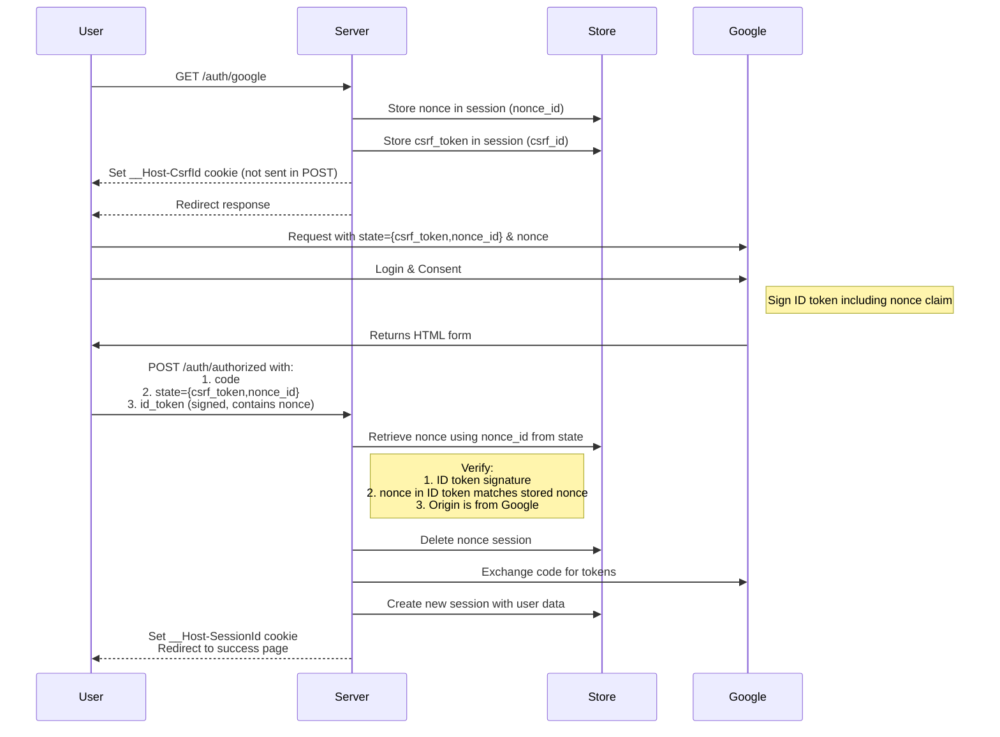
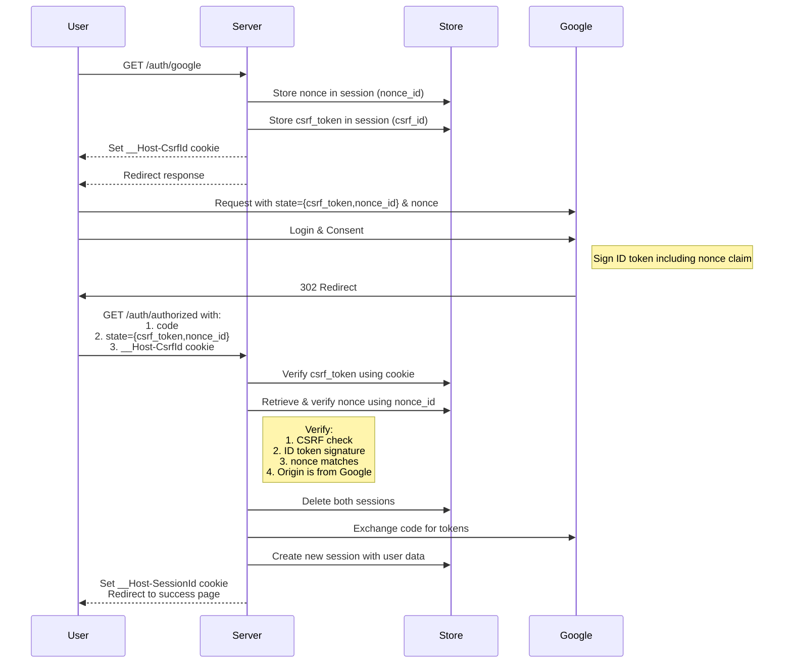

# axum google oauth2 example

- [axum google oauth2 example](#axum-google-oauth2-example)
  - [Howto](#howto)
  - [security enhancement by csrf\_token](#security-enhancement-by-csrf_token)
    - [response\_mode=query](#response_modequery)
  - [Claude.ai analysis](#claudeai-analysis)
    - [1. Form Post Mode](#1-form-post-mode)
    - [2. Query Mode](#2-query-mode)
    - [Recommendation:](#recommendation)
  - [Old explanation](#old-explanation)
    - [response\_mode=query](#response_modequery-1)
    - [response\_mode=form\_post](#response_modeform_post)
  - [Why is the \_\_Host-CsrfId sent in query mode but not in form\_post?](#why-is-the-__host-csrfid-sent-in-query-mode-but-not-in-form_post)

## Howto

もともとdiscord用の[axum/examples/oauth](https://github.com/tokio-rs/axum/blob/main/examples/oauth/src/main.rs)を改造

```text
ngrok http 3000
```

.envで、ngrokのURLをORIGINに設定

.env

```text
CLIENT_ID=$client_id
CLIENT_SECRET=$client_secret
ORIGIN="https://xxxxx.ngrok-free.app"
#ORIGIN='https://localhost:3443'
```

```text
cargo watch -x run
```

## security enhancement by csrf_token

### response_mode=query


- storeにCsrfIdをキーとして保存されているcsrf_tokenと、stateにセットされているcsrf_tokenが一致しないと、⑥以降の処理に進まない。
- 攻撃者が、③までを実行すると、正しいcsrf_token、CsrfId、Auth codeを入手することができてしまう
- 攻撃者は、被害者を攻撃者のアカウントにログインさせることで、不正に情報を取得するなどが可能になる
  - [攻撃の例](csrf-attack-example.md)

- `_Host-` プリフィックスにより、Cookieがそのホストにによりセットされたことが保証される。
- `User-Agent`チェックを行うことで、攻撃を若干難しくすることができるかも？？？
- Origin/Refererチェックにより、`https://accounts.google.com`からの遷移であることが保証される。

## Claude.ai analysis

Let me break this down into two clear analyses:

### 1. Form Post Mode



Form Post Mode Analysis:

```text
Strengths:
1. Authorization code never exposed in URL
2. Protection against token interception via:
   - Server-side nonce storage (only ID in state)
   - Google-signed ID token
   - One-time use sessions
3. Origin validation ensures request from Google
4. Code and tokens sent in POST body

Potential Concerns:
1. Can't validate csrf_token due to SameSite=Lax cookie behavior
2. State parameter could be modified (but limited impact due to server-side storage)
```

### 2. Query Mode



Query Mode Analysis:
```
Strengths:
1. Full CSRF protection
2. Double verification (CSRF + nonce)
3. Server-side session validation
4. One-time use sessions

Concerns:
1. Authorization code exposed in URL
2. Potential logging of sensitive parameters
3. Possible code leakage via Referer header
```

### Recommendation:

I recommend using FORM POST mode because:

1. The primary security concern in OAuth is protecting the authorization code
2. Form post mode better protects the code by:
   - Never exposing it in URLs
   - Preventing Referer header leaks
   - Avoiding browser history/log exposure
3. While it lacks CSRF protection, the combination of:
   - Server-side nonce storage
   - Google-signed ID token
   - Origin validation
   - One-time use sessions
   Provides sufficient security against most attack vectors
4. The benefits of protecting the authorization code outweigh the benefits of CSRF protection in this specific use case

The trade-off between CSRF protection vs code exposure favors protecting the code, making form post mode the more secure choice.

## Old explanation

Old

### response_mode=query


Here's a explanation of the OAuth2 flow diagram with CSRF protection:

1. Initial Flow (Steps 1-2):
- Client requests `/auth/google`
- Server:
  - Generates csrf_token
  - Creates session with csrf_token
  - Stores session in store with CsrfId
  - Sets `__Host-CsrfId` cookie
  - Redirects to Google OAuth with state=csrf_token

1. Google Auth (Step 3):
- User authenticates with Google
- Google redirects back with:
  - Authorization code
  - Original state parameter (csrf_token)

1. Validation & Token Exchange (Steps 4-6):
- Client sends:
  - Authorization code
  - State parameter
  - `__Host-CsrfId` cookie
- Server validates:
  - Loads session using CsrfId cookie
  - Compares stored csrf_token with state parameter
  - Checks Origin/Referer is from Google
  - Verifies User-Agent matches
- If valid:
  - Exchanges code for access_token & id_token
  - Creates authenticated session
  - Sets `__Host-SessionId` cookie

Security Features:
- `__Host-` prefix enforces secure, host-only cookies
- State parameter prevents CSRF attacks
- Origin/Referer validation ensures redirect from Google
- User-Agent checking adds extra layer of validation
- Short-lived CSRF sessions (60 seconds)

### response_mode=form_post

Here's a diagram showing what happens with response_mode=form_post and explaining the cookie behavior:


The key points:

1. Form POST Mechanism:

```html
<!-- Google returns this auto-submitting form -->
<form method="post" action="https://your-site/auth/authorized">
    <input type="hidden" name="code" value="4/P7q7W91a-oMsCeLvIaQm6bTrgtp7">
    <input type="hidden" name="state" value="original_csrf_token">
    <input type="hidden" name="id_token" value="eyJ0...">
    <script>window.onload = function() { document.forms[0].submit() }</script>
</form>
```

2. Cookie Behavior:

- The `__Host-CsrfId` cookie has `SameSite=Lax`
- With `SameSite=Lax`, cookies are only sent in these cases:
  - Same-site requests
  - Cross-site GET requests
- They are NOT sent for:
  - Cross-site POST requests (which is what Google's form submit is)
- This is why the CSRF verification fails - the cookie isn't present

This explains why your code has separate handling for GET and POST in the `/auth/authorized` endpoint.

## Why is the __Host-CsrfId sent in query mode but not in form_post?

The difference between response_mode=query and form_post:


The key difference is:

1. Query mode (code & state in URL):

- Uses HTTP 302 redirect
- Triggers browser's top-level navigation
- `SameSite=Lax` cookies ARE sent with top-level navigation GET requests
- The CSRF protection works as intended

2. Form POST mode:

- Uses HTML form submission from Google's domain
- Is a cross-origin POST request
- NOT a top-level navigation
- `SameSite=Lax` cookies are NOT sent

This is why CSRF verification works in query mode but fails in form_post mode. The browser treats these navigation patterns differently with respect to SameSite cookie policy.
